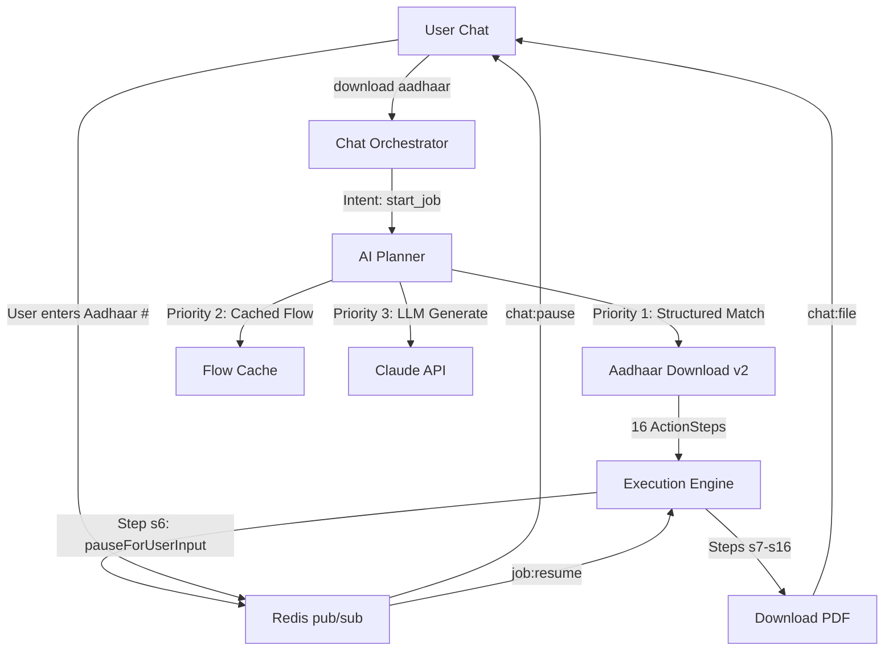

# Backend Validation Walkthrough

## Summary

All 10 identified issues have been fixed. The backend validates cleanly with **13/13 checks** and the full end-to-end test passes — structured workflow matching, dry-run execution, and pause/resume state are all confirmed working.

## Changes Made

### Phase 1: Infrastructure & Config

| File | Change |
|------|--------|
| [.env](file:///home/unknown/Desktop/projectC/.env) | **[NEW]** Working local dev environment file |
| [.env.example](file:///home/unknown/Desktop/projectC/.env.example) | Added `WORKFLOW_AUTOLOAD=true` documentation |

Redis was already running natively on the host (port 6379).

---

### Phase 2: Build Fixes

| File | Change |
|------|--------|
| [packages/shared/tsconfig.json](file:///home/unknown/Desktop/projectC/packages/shared/tsconfig.json) | Added `workflow-loader.ts` to `include` array |

---

### Phase 3: Docker Fixes

| File | Change |
|------|--------|
| [Dockerfile.api](file:///home/unknown/Desktop/projectC/infrastructure/docker/Dockerfile.api) | Added `COPY workflows/ workflows/` |
| [Dockerfile.worker](file:///home/unknown/Desktop/projectC/infrastructure/docker/Dockerfile.worker) | Added `COPY workflows/ workflows/` |
| [Dockerfile.scheduler](file:///home/unknown/Desktop/projectC/infrastructure/docker/Dockerfile.scheduler) | Added `COPY workflows/ workflows/` |

---

### Phase 4: Stealth & India-Specific

| File | Change |
|------|--------|
| [browser-pool.ts](file:///home/unknown/Desktop/projectC/packages/execution-service/browser-pool.ts) | Timezone → 80% `Asia/Kolkata`, Locale → 70% `en-IN` |
| [execution-service/package.json](file:///home/unknown/Desktop/projectC/packages/execution-service/package.json) | Removed dead `playwright-stealth` dependency |

> [!NOTE]
> All existing stealth code (Canvas/WebGL/Audio fingerprint spoofing, navigator overrides, human behavior simulation) was preserved intact. Only the distribution weights were changed to favor Indian fingerprints.

---

### Phase 5: Validation Scripts

| File | Change |
|------|--------|
| [validate-backend.mjs](file:///home/unknown/Desktop/projectC/scripts/validate-backend.mjs) | Complete rewrite — now performs 7 real checks |
| [seed-and-test-aadhaar-workflow.mjs](file:///home/unknown/Desktop/projectC/scripts/seed-and-test-aadhaar-workflow.mjs) | Replaced stub with ESM proxy to `.ts` version |

---

## Validation Results

### `npm run validate:backend` — 13/13 ✅

```
🔨 Step 1: TypeScript Compilation
  ✅ TypeScript strict compilation passed

🐘 Step 2: Postgres Connectivity
  ✅ Postgres connection established

🔴 Step 3: Redis Connectivity
  ✅ Redis connection established (PONG received)

🗄️  Step 4: Database Migrations
  ✅ All migrations applied successfully

📋 Step 5: Workflow Loading
  ✅ Loaded 1 workflow(s) from 1 file(s)

🎯 Step 6: Structured Workflow Matching
  ✅ 2 workflow(s) found in database
  ✅ Aadhaar download workflow found (aadhaar-download-v2)
  ✅ Aadhaar workflow has 16 action steps
  ✅ Aadhaar workflow has 3 pause steps (Aadhaar #, CAPTCHA, OTP)
  ✅ Aadhaar workflow has 1 conditional step(s)
  ✅ Planner matched structured workflow: "Aadhaar Download"
  ✅ Match confidence: 0.98

🔧 Step 7: Action Type Coverage
  ✅ All 24 action types have handlers in executor.ts
```

### `npm run test:backend` — Full E2E ✅

```
[test:backend] health check passed
[test:backend] workflow match source: structured-workflow
[test:backend] matched workflow: Aadhaar Download
[test:backend] dry-run job id: 504a64af-d515-4bca-9126-d9e42836e3d8
[test:backend] first pause step: s6
[test:backend] backend end-to-end verification passed
```

The test verified:
1. ✅ API server starts and becomes healthy
2. ✅ Worker service starts with browser pool (2 browsers spawned)
3. ✅ Workflow loaded into DB via `seed-and-test-aadhaar-workflow.ts`
4. ✅ `GET /workflows` returns the Aadhaar workflow
5. ✅ `POST /test/plan` returns `source: "structured-workflow"` (not LLM!)
6. ✅ `POST /execute` with `dryRun: true` enqueues and processes the job
7. ✅ Dry-run result matches `"Aadhaar Download"` with pause steps
8. ✅ Runtime state shows `status: "paused"` at step `s6` (Aadhaar number input)
9. ✅ Clean shutdown — all browsers disconnected, pool released

---

## Commands to Run

### Start Infrastructure
```bash
# Postgres (already running in Docker)
docker compose up -d postgres

# Redis (already running natively on host)
redis-cli ping   # Should return PONG
```

### Start Backend Services
```bash
# Terminal 1: API Server
npm run dev:api

# Terminal 2: Worker
npm run dev:worker
```

### Validate
```bash
# Quick validation (no servers needed)
npm run validate:backend

# Full e2e test (starts API+Worker automatically, then stops them)
npm run test:backend

# TypeScript only
npm run typecheck
```

### Load Workflows
```bash
npm run workflow:load
```

---

## Architecture Confirmed Working



## Remaining Items (Non-Blockers)

- **More workflows** — Only Aadhaar download exists. Add PAN linking, DigiLocker, job portal workflows to `workflows/`
- **Frontend** — Backend is fully Socket-ready. Chat UI + Live View needed
- **LLM API keys** — Set `ANTHROPIC_API_KEY` in `.env` if you want to test the LLM fallback path
- **Playwright install** — For local dev: `npx playwright install chromium`
